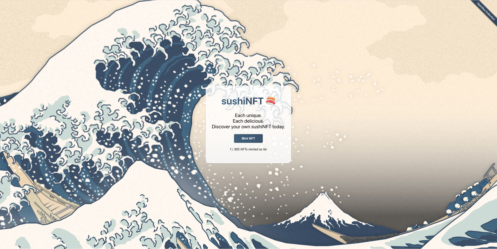
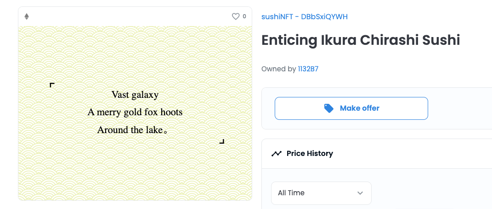

# Contract and NFT details

- This is a fun project to learn about the Solidity programming language, smart contracts and NFTs! 

- The sushiNFT dApp's front-end [is published here](https://sushi.ben.express/)

- The contract address on [rinkeby etherscan](https://rinkeby.etherscan.io/address/0x0713dbA8E86881DE2465ab469570dD8C6995b983) is 0x0713dbA8E86881DE2465ab469570dD8C6995b983

- Minted NFTs can be seen on the [OpenSea Rinkeby Testnet](https://testnets.opensea.io/collection/sushinft-25hek49stz). They are ERC721 types tokens

- The [MetaMask Browser Extension](https://chrome.google.com/webstore/detail/metamask/nkbihfbeogaeaoehlefnkodbefgpgknn?hl=en) and an Account on the [Rinkeby test network](https://www.rinkeby.io/) are necessary to use this app!

- Each sushiNFT will generate a unique japanese haiku, an unrhymed three-line poem. sushiNFTs are hosted 100% on chain, as base64 encoded programmatically generated SVGs which makes them permanent and secure

# Stack

Hardhat, Solidity, JavaScript, React, [Alchemy](https://www.alchemy.com/) entrypoint to Ethereum node APIs.

Smart contract deployed on the Rinkeby Test Network.

React front-end deployed on Netlify.

# Notes to self

Any time the contract is changed:

- Update contract address and OpenSea address in the front-end's .env file
- Update the ABI file in the `./utils` folder
- Redeploy
- Update environment variables on Netlify

# Compile smart contract and deploy it

**Run the following commands from withing the `smart-contract` directory.**

1. Run `npx hardhat run scripts/run.js` from the project root. This will test that the contract compiles as expected. Shortcut command established as a script in the package.json is `npm start`

2. Run `npx hardhat run scripts/deploy.js --network rinkeby` to deploy to the Rinkeby testnet. Grab the contact address and assign it to the REACT_APP_DEPLOYED_RINKEBY_CONTRACT_ADDRESS constant in the .env file in the front-end. Shortcut command established as a script in the package.json is `npm run deploy`

3. Copy the freshly made `./smart-contract/artifacts/contracts/sushiNFT.sol/sushiNFT.json` file to `./utils/sushiNFT.json` so that the front-end uses the latest ABI.

4. Once OpenSea picks up the contract, grab the new URL (i.e. `https://testnets.opensea.io/collection/sushinft-someId`) and assign it to the REACT_APP_OPENSEA_LINK constant in the .env file in the front-end.

# Useful Reference Docs

- [OpenZeppelin ERC721 contract implementation (Github)](https://github.com/OpenZeppelin/openzeppelin-contracts/blob/master/contracts/token/ERC721/ERC721.sol).

- [Metamask API - JSON-RPC methods](https://docs.metamask.io/guide/rpc-api.html#ethereum-json-rpc-methods)

- [ethers.js docs](https://docs.ethers.io/v5/api/signer/#signers)

# Useful tools

- [base64 encoding and decoding](https://www.utilities-online.info/base64)

- [rinkeby etherscan](https://rinkeby.etherscan.io/)

- [NFT previewer](https://nftpreview.0xdev.codes/)

- [ethereum JSON RPC methods + playground](https://playground.open-rpc.org/?schemaUrl=https://raw.githubusercontent.com/ethereum/eth1.0-apis/assembled-spec/openrpc.json&uiSchema%5BappBar%5D%5Bui:splitView%5D=true&uiSchema%5BappBar%5D%5Bui:input%5D=false&uiSchema%5BappBar%5D%5Bui:examplesDropdown%5D=false)

- [SVG editor](https://editor.method.ac/)

- [SVG viewer](https://www.svgviewer.dev/)
